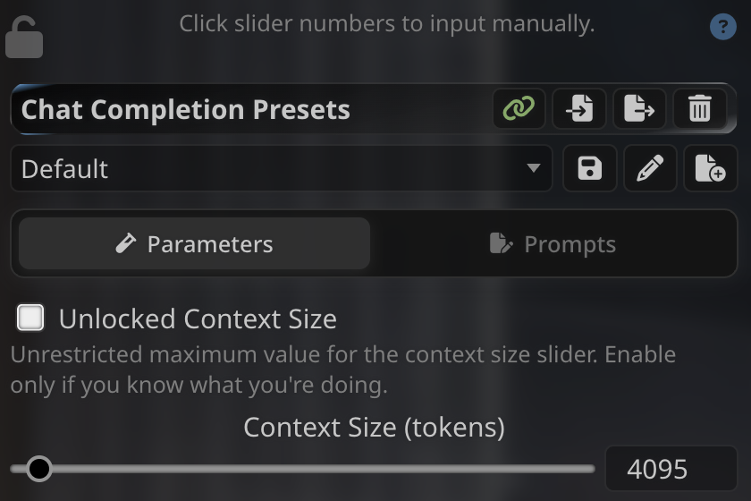

# IF Combo

IF Combo bundles practical SillyTavern interface tools in one extension:

- Parameters/Prompts tabs keep the Chat Completion preset editor tidy.
- Locked Context Size keeps the configured context limit stable.
- Temperature, Top P, Frequency Penalty, and Presence Penalty use compact controls to save space.
- The status bar below the top bar shows the active model, chat, and persona at a glance. Click the chat name to open the chat manager.
- The prompt picker replaces the prompt dropdown in the preset editor footer with inline insert/delete buttons on each row; already-inserted prompts show a check mark instead of the insert button.
- The input history button next to Send reopens previously sent inputs (stored locally, most recent first).



## Installation

Go to **Extensions > Install extension** , then paste the following Git URL:
```
https://github.com/imaginaryfriend1208-gif/IF-Combo
```

#  License
AGPL-3.0
